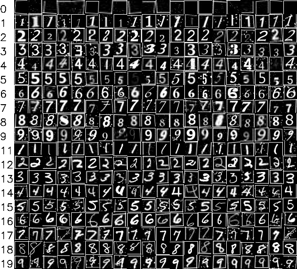
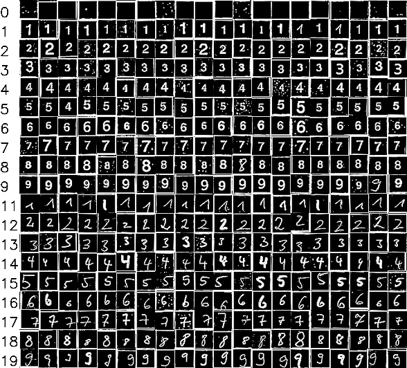

Digit Recognition Architecture
==============================

Datasets
--------

Overview
^^^^^^^^

.. _MNIST: http://yann.lecun.com/exdb/mnist/

.. _`Handwritten Characters Database`: https://github.com/sueiras/handwritting_characters_database

Using the classes and methods from the :doc:`simulation` we can construct a large dataset for digit recognition.
The core difference to existing datasets are the inclusion of both machine-written and hand-written digits and the
possibility to create noisy data with a large amount of variation. The second is necessary because the environment in
which our project is going to be used is inherently noisy and as such requires training data which reflects this.

The generation of the training and development datasets is handled in :doc:`training.generate_datasets.py`. The
methods described there make use of 4 different base datasets:

- the MNIST_ dataset of 70,000 hand-written digits,
- the `Handwritten Characters Database`_ of 62,382 hand-written digits,
- an dataset of unknown license we simply call the 'Digit Dataset' of 8,235 machine-written digits,
- a dynamic dataset of machine-written characters in 325 fonts generated through this project,

Additionally we created and annotated a test dataset of 5,427 digits generated from real Sudokus through our CV
pipeline.

Expansion
^^^^^^^^^

The 4 base datasets are expanded by use of the various transform and noise methods described in
:doc:`simulation.transforms` to a total of 832,896 to 110,658 images in the training and development split respectively.
The pipelines in :doc:`training.generate_datasets.py` make use of the following transforms: ::
    # Transform pipeline for machine-written data
    dataset = machine_written_dataset
    dataset.add_transforms(EmbedInRectangle())
    dataset.add_transforms(EmbedInGrid())
    dataset.apply_transforms(keep=False)  # -> 20086 images in train split

    dataset.add_transforms(upscale_and_salt)
    dataset.add_transforms(GrainNoise())
    dataset.apply_transforms()  # -> 60258 images in train split

    dataset.add_transforms(perspective_transform)
    dataset.add_transforms(perspective_transform, JPEGEncode())
    dataset.add_transforms(downscale_intermediate_transforms)
    dataset.add_transforms(PoissonNoise(), JPEGEncode())
    dataset.add_transforms(JPEGEncode())
    dataset.apply_transforms()  # -> 361548 images in train split

    # Transform pipeline for hand-written data
    dataset = hand_written_dataset
    dataset.add_transforms(EmbedInRectangle())
    dataset.add_transforms(EmbedInGrid())
    dataset.apply_transforms(keep=False)  # -> 124748 images in train split

    dataset.add_transforms(upscale_and_salt, perspective_transform, JPEGEncode())
    dataset.add_transforms(GrainNoise(), perspective_transform)
    dataset.apply_transforms()  # -> 374244 images in train split

    # Transform pipeline for 'out' data
    dataset = out_dataset
    dataset.add_transforms(EmbedInGrid(), upscale_and_salt)
    dataset.add_transforms(EmbedInGrid(), GrainNoise())
    dataset.add_transforms(EmbedInRectangle())
    dataset.apply_transforms(keep=False)  # -> 32400 images in train split

    dataset.add_transforms(downscale_intermediate_transforms)
    dataset.add_transforms(perspective_transform, JPEGEncode())
    dataset.add_transforms(JPEGEncode())
    dataset.apply_transforms(keep=False)  # -> 97200 images in train split

Results
^^^^^^^

Figure 1 below show the result of the transforming while figure 2 shows some samples from the real-data test set.
The samples are aligned by class (first column) where class ``0`` denotes empty fields, classes ``1-9`` denote machine written digits,
classes ``11-19`` denote hand-written digits and class ``10`` denotes the currently unused out class, reserved for
non-numeric characters.

   Figure 1: Training Samples (sythetic)

   Figure 2: Test Samples (real)

Model Architecture
------------------

Overview
^^^^^^^^

We chose a *Convolutional Neural Net* architecture for our digit classifier.

Simple 10 class model with 71,822 weights: ::

           OPERATION           DATA DIMENSIONS   WEIGHTS(N)   WEIGHTS(%)

               Input   #####     28   28    1
              Conv2D    \|/  -------------------       160     0.2%
                       #####     26   26   16
  BatchNormalization    μ|σ  -------------------        64     0.1%
                relu   #####     26   26   16
        MaxPooling2D   Y max -------------------         0     0.0%
                       #####     13   13   16
              Conv2D    \|/  -------------------      2080     2.9%
                       #####     12   12   32
  BatchNormalization    μ|σ  -------------------       128     0.2%
                relu   #####     12   12   32
        MaxPooling2D   Y max -------------------         0     0.0%
                       #####      6    6   32
              Conv2D    \|/  -------------------     18496    25.7%
                       #####      4    4   64
        MaxPooling2D   Y max -------------------         0     0.0%
                       #####      2    2   64
  BatchNormalization    μ|σ  -------------------       256     0.4%
                relu   #####      2    2   64
             Flatten   ||||| -------------------         0     0.0%
                       #####         256
               Dense   XXXXX -------------------     32896    45.8%
                relu   #####         128
             Dropout    | || -------------------         0     0.0%
                       #####         128
               Dense   XXXXX -------------------     16512    23.0%
                relu   #####         128
               Dense   XXXXX -------------------      1290     1.8%
                       #####          10

Full 20 class model with 73,172 weights: ::

           OPERATION           DATA DIMENSIONS   WEIGHTS(N)   WEIGHTS(%)

               Input   #####     28   28    1
              Conv2D    \|/  -------------------       160     0.2%
                       #####     26   26   16
  BatchNormalization    μ|σ  -------------------        64     0.1%
                relu   #####     26   26   16
        MaxPooling2D   Y max -------------------         0     0.0%
                       #####     13   13   16
              Conv2D    \|/  -------------------      2080     2.8%
                       #####     12   12   32
  BatchNormalization    μ|σ  -------------------       128     0.2%
                relu   #####     12   12   32
        MaxPooling2D   Y max -------------------         0     0.0%
                       #####      6    6   32
              Conv2D    \|/  -------------------     18496    25.3%
                       #####      4    4   64
        MaxPooling2D   Y max -------------------         0     0.0%
                       #####      2    2   64
  BatchNormalization    μ|σ  -------------------       256     0.3%
                relu   #####      2    2   64
             Flatten   ||||| -------------------         0     0.0%
                       #####         256
               Dense   XXXXX -------------------     32896    45.0%
                relu   #####         128
             Dropout    | || -------------------         0     0.0%
                       #####         128
               Dense   XXXXX -------------------     16512    22.6%
                relu   #####         128
               Dense   XXXXX -------------------      2580     3.5%
                       #####          20

Binary classification model with 7,041 weights: ::

           OPERATION           DATA DIMENSIONS   WEIGHTS(N)   WEIGHTS(%)

               Input   #####     28   28    1
              Conv2D    \|/  -------------------       416     5.9%
                       #####     12   12   16
  BatchNormalization    μ|σ  -------------------        64     0.9%
                relu   #####     12   12   16
        MaxPooling2D   Y max -------------------         0     0.0%
                       #####      3    3   16
              Conv2D    \|/  -------------------      2080    29.5%
                       #####      2    2   32
  BatchNormalization    μ|σ  -------------------       128     1.8%
                relu   #####      2    2   32
        MaxPooling2D   Y max -------------------         0     0.0%
                       #####      1    1   32
             Flatten   ||||| -------------------         0     0.0%
                       #####          32
               Dense   XXXXX -------------------      4224    60.0%
                relu   #####         128
             Dropout    | || -------------------         0     0.0%
                       #####         128
               Dense   XXXXX -------------------       129     1.8%
             sigmoid   #####           1

Scripts
-------

.. toctree::
    training.generate_datasets.py
    training.training.py
    training.training_binary.py
